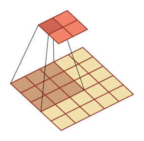
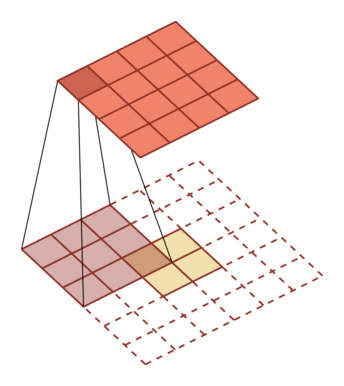
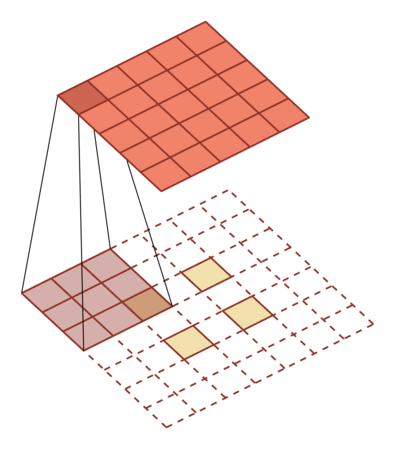
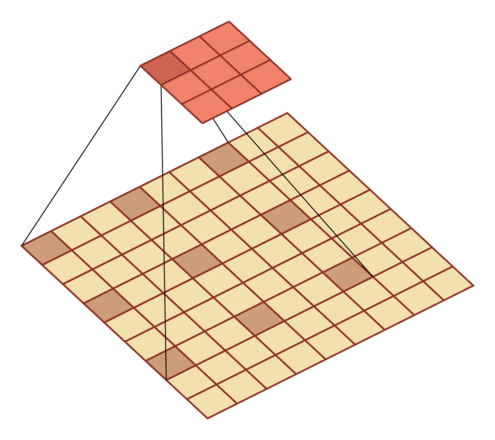

# 二维卷积示例 

## 卷积

| 5x5              | 9x9              |              |
| ---------------- | ---------------- | ------------ |
|                  |                  |              |
| m=3,p = 0 ,s = 1 | m=3,p = 2 ,s = 2 | p = 0 ,s = 1 |
|                  |                  |              |
| m=3,p = 2 ,s = 1 | m=5,p = 4 ,s = 1 |              |

 p 表示零填充大小（zero-padding）， s 表示步长（stride）。

## 转置卷积

|               p = 0 ,s = 1               |               p = 0 ,s = 2               |
| :--------------------------------------: | :--------------------------------------: |
|  |  |
|                    卷积                    |                    卷积                    |
|  |  |
|                   转置卷积                   |                   转置卷积                   |

 p 表示零填充大小（zero-padding）， s 表示步长（stride）。

## 空洞卷积

|                                          |                   |
| :--------------------------------------: | :---------------: |
|  |                   |
|            p = 0, s = 1, d=2             | p = 0, s = 1, d=1 |
 p 表示零填充大小（zero-padding）， s 表示步长（stride），d表示膨胀率（dilation）。

图片修改自： Vincent Dumoulin, Francesco Visin - [A guide to convolution arithmetic
for deep learning](https://arxiv.org/abs/1603.07285)