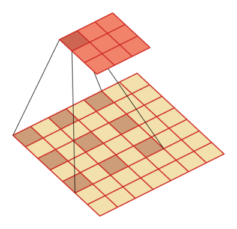

# 二维卷积示例 

## 卷积
|                 步长 s = 1                 |                 步长 s = 2                 |
| :--------------------------------------: | :--------------------------------------: |
|  |  |
|           m = 3, p = 0 ,s = 1            |           m = 3, p = 2 ,s = 2            |
|  |  |
|           m = 3, p = 2 ,s = 1            |            m=5, p = 2 ,s = 2             |

 m表示卷积核大小，p 表示零填充大小（zero-padding）， s 表示步长（stride）。

## 转置卷积

|           m = 3, p = 0 ,s = 1            |           m = 3,  p = 0 ,s = 2           |
| :--------------------------------------: | :--------------------------------------: |
|  |  |
|                    卷积                    |                    卷积                    |
|  |  |
|                   转置卷积                   |                   转置卷积                   |

 m表示卷积核大小， p 表示零填充大小（zero-padding）， s 表示步长（stride）。

## 空洞卷积

|           m = 3, p = 0, s = 1            |           m = 3, p = 0, s = 1            |
| :--------------------------------------: | :--------------------------------------: |
|  |  |
|                   d=1                    |                   d=2                    |
  m表示卷积核大小，p 表示零填充大小（zero-padding）， s 表示步长（stride），d表示膨胀率（dilation）。

图片修改自： Vincent Dumoulin, Francesco Visin - [A guide to convolution arithmetic
for deep learning](https://arxiv.org/abs/1603.07285)