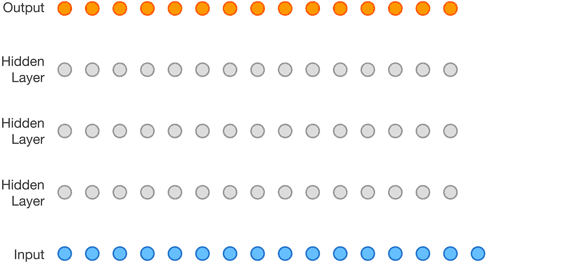

# 序列到序列示例 

## 基于循环神经网络的序列到序列模型

图片来源： <https://github.com/google/seq2seq>

## Transformer示例

图片来源： <https://ai.googleblog.com/2017/08/transformer-novel-neural-network.html>

## 基于前馈神经网络的序列到序列示例

图片来源：<<https://deepmind.com/blog/wavenet-generative-model-raw-audio/>>

## 基于卷积神经网络的序列到序列示例

图片来源：<https://github.com/facebookresearch/fairseq/blob/master/fairseq.gif>
